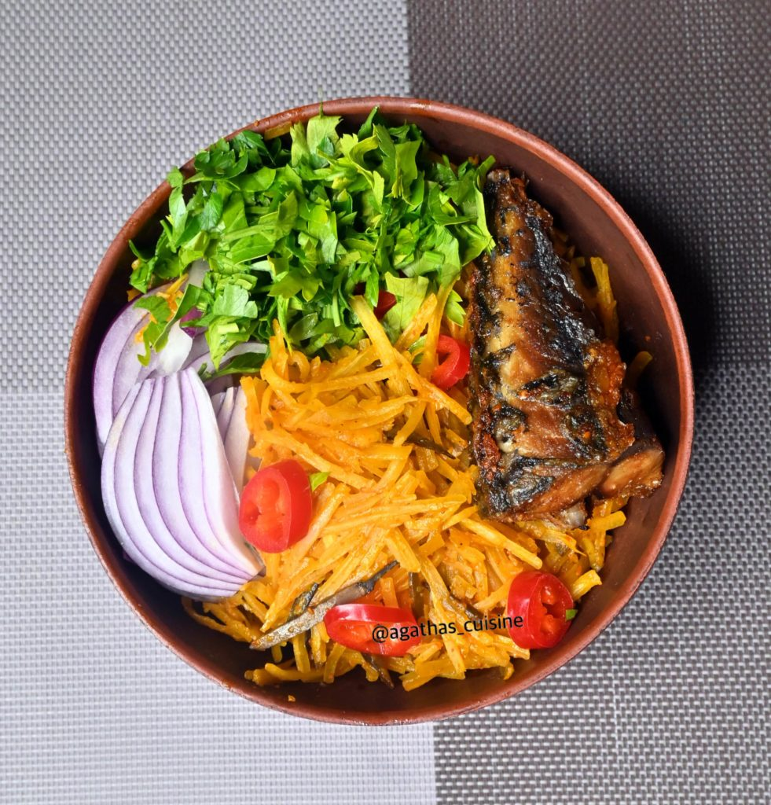
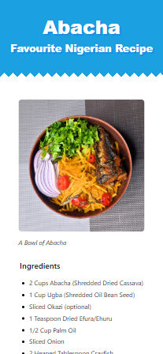
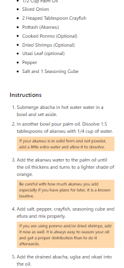
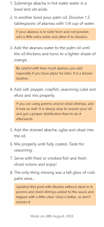
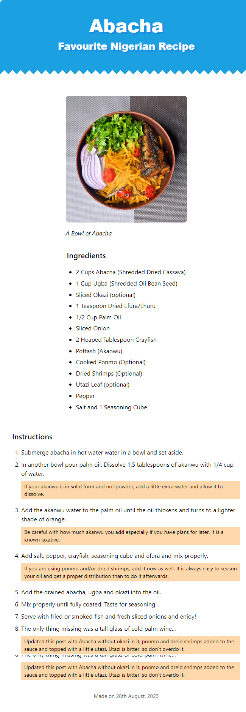
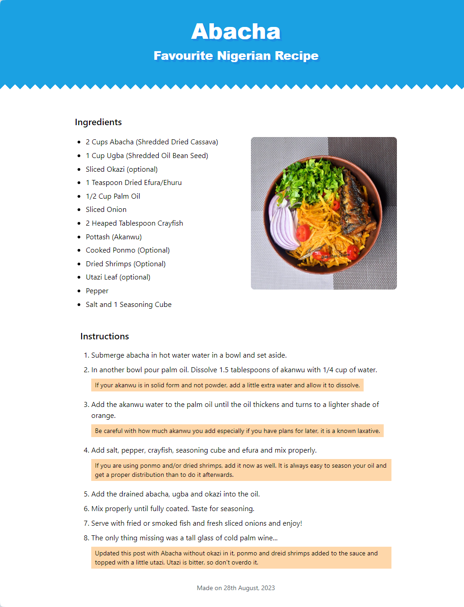
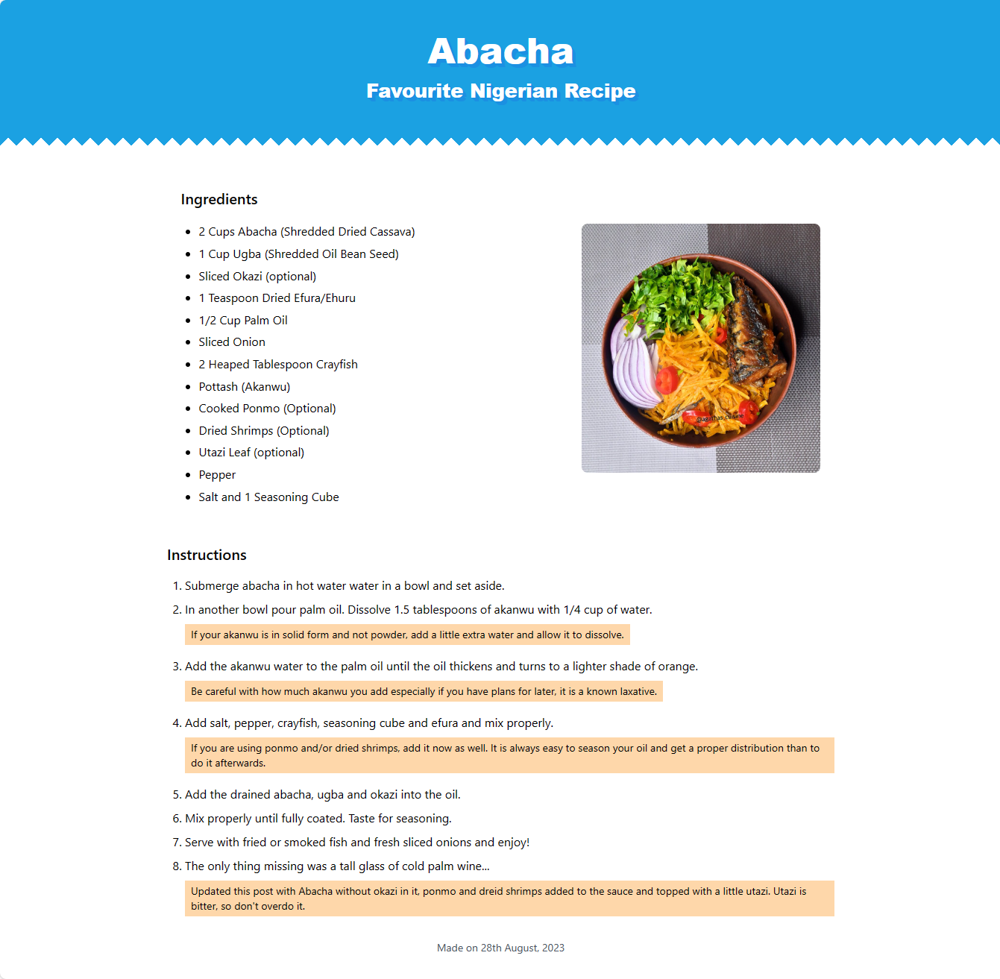

[![Contributors][contributors-shield]][contributors-url]
[![Forks][forks-shield]][forks-url]
[![Stargazers][stars-shield]][stars-url]
[![Issues][issues-shield]][issues-url]
[![LinkedIn][linkedin-shield]][linkedin-url]

<!-- PROJECT LOGO -->
<br />
<div align="center"> 
  

  <h3 align="center">Nigerian Recipe Page with React.js and Basic Tailwind CSS</h3>

  <p align="center">
    StackTrek Quiz
    <br />
    <a href="https://recipe-page-eta.vercel.app/"><strong>See Live Version »</strong></a>
    <br />
    <br />
    <a href="https://recipe-page-eta.vercel.app/">View Demo</a>
    ·
    <a href="https://github.com/Chizaram-Igolo/recipe-page/issues">Report Bug</a>
    ·
    <a href="https://github.com/Chizaram-Igolo/recipe-page/issues">Request Feature</a>
  </p>
</div>

<!-- TABLE OF CONTENTS -->
  <p>Table of Contents</p>
  <ol>
    <li>
      <a href="#about-the-project">About The Project</a>
      <ul>
        <li><a href="#built-with">Built With</a></li>
      </ul>
    </li>
    <li>
      <a href="#getting-started">Getting Started</a>
      <ul>
        <li><a href="#prerequisites">Prerequisites</a></li>
        <li><a href="#installation">Installation</a></li>
      </ul>
    </li>
    <li><a href="#screenshots">Screenshots</a>
    </li> 
  </ol>

<!-- ABOUT THE PROJECT -->

## About The Project


This is a frontend application built with React.js that displays a recipe page.

## Built With

- [![React][React.js]][React-url]
- [![Vite][Vite]][Vite-url]
- [![TypeScript][TypeScript]][TypeScript-url]
- [![TailwindCSS][TailwindCss]][TailwindCSS-url]

<!-- GETTING STARTED -->

## Getting Started

To get a local copy up and running follow these simple example steps.

### Prerequisites

You need to have `npm` installed on your computer in order to be able to install and run the project.

- npm
  ```sh
  npm install npm@latest -g
  ```

### Installation

1. Clone the repo
   ```sh
   git clone https://github.com/Chizaram-Igolo/recipe-page.git
   ```
2. Install NPM packages
   ```sh
   cd recipe-page && npm install
   ```
3. Run the Project
   ```sh
   npm run dev
   ```
4. Navigate to `http://127.0.0.1:5173/` (or the exposed port) on your favourite browser

<!-- USAGE EXAMPLES -->

## Screenshots

The following show the display of the web page across multiple devices.

### 1. Mobile Screen

<table>
<tr>
<th></th>
<th></th>
<th></th>
</tr>
<tr>
<td>
  

</td>

<td> 

</td>

<td>

</td>
</tr>
</table>

<br/>

### 1. Tablet Screen

<table>
<tr>
<th></th>
<th></th>
</tr>
<tr>

<td>  
 
</td>

<td>

</td>

</tr>
</table>

<br/>

### 1. Desktop Screen

<table>
<tr>
<th></th> 
</tr>
<tr>
<td>
<div style="">

</div>
</td>
</tr>
</table>

<br/>

<!-- MARKDOWN LINKS & IMAGES -->
<!-- https://www.markdownguide.org/basic-syntax/#reference-style-links -->

[contributors-shield]: https://img.shields.io/github/contributors/Chizaram-Igolo/recipe-page.svg?style=for-the-badge
[contributors-url]: https://github.com/Chizaram-Igolo/recipe-page/graphs/contributors
[forks-shield]: https://img.shields.io/github/forks/Chizaram-Igolo/recipe-page.svg?style=for-the-badge
[forks-url]: https://github.com/Chizaram-Igolo/recipe-page/network/members
[stars-shield]: https://img.shields.io/github/stars/Chizaram-Igolo/recipe-page.svg?style=for-the-badge
[stars-url]: https://github.com/Chizaram-Igolo/recipe-page/stargazers
[issues-shield]: https://img.shields.io/github/issues/Chizaram-Igolo/recipe-page.svg?style=for-the-badge
[issues-url]: https://github.com/Chizaram-Igolo/recipe-page/issues
[linkedin-shield]: https://img.shields.io/badge/-LinkedIn-black.svg?style=for-the-badge&logo=linkedin&colorB=555
[linkedin-url]: https://linkedin.com/in/emmanueligolo
[React.js]: https://img.shields.io/badge/React-20232A?style=for-the-badge&logo=react&logoColor=61DAFB
[React-url]: https://reactjs.org/
[Vite]: https://img.shields.io/badge/vite-%23646CFF.svg?style=for-the-badge&logo=vite&logoColor=white
[Vite-url]: https://vitejs.dev/
[TypeScript]: https://img.shields.io/badge/typescript-%23007ACC.svg?style=for-the-badge&logo=typescript&logoColor=white
[TypeScript-url]: https://www.typescriptlang.org/
[TailwindCSS]: https://img.shields.io/badge/tailwindcss-%2338BDF8.svg?style=for-the-badge&logo=tailwind-css&logoColor=white
[TailwindCSS-url]: https://tailwindcss.com/
